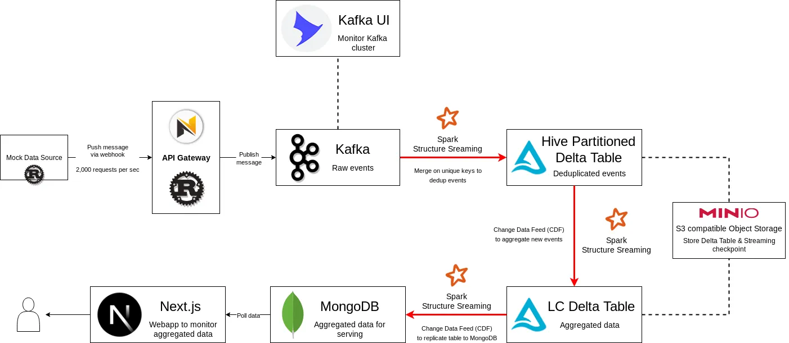

## 🚀 Kafka Real-time Streaming into Liquid Clustering Delta Table

This mini project is for testing capability of **Liquid Clustering (LC)** and **Change Data Feed (CDF)** features of the **OSS Delta Table** which is opensource and *GA* around May 2024 (previously proprietary only in **Databricks Runtime**).

1. **Liquid Cluster:** is a new paradigm with greater performance in optimizing the query/filter big data table stored in **Delta Table** format! Traditionally, one have to do **Hive-style partitioned** and **Z Order** to optimize such tables, which have various limitations (e.g., not suitable for high cardinality columns, requires to re-create table on changing partition columns etc.).
2. **Change Data Feed:** is a cool feature for *Delta Table* to allow each operation to be emitted as an event. With this feature, we can use *Delta Table* as streaming source to replicate data to the other sinks!

### TLDR;

From quick testing, **OSS Liquid Clustering** still have some limitations especially on *MERGE* operation on forever growing table like timeseries data 🤔. Since *Dynamic File Pruning* feature is not available in OSS version 😭 (this feature only in available in Databricks runtime lol), a lot of files are shuffled during *MERGE* and can easily lead to **OOM** error eventually.
 
In such case, *Hive Paritioned* style can be more efficient in pruning files to maintain memory usage with in acceptable amount.

## ⚙️ Quick Setup

1. Install [Just], since this project use [Just] to store running scripts
2. Run `just run-app` to spinup everything mentioning in [Architecture] section
3. Run `just teardown-app` to destroy every resources of the project in *docker-compose*

## 🏗️ Architecture

The architecture for this project to test the capability of *Delta Table* is as shown below:

1. **Mock Data Source:** Mock event generator source written in Rust, on my testing I set it up at 2,000 RPS.
2. **API Gateway:** Webhook REST API server also written in *Rust* using *Ntex* framework. *Mock Data Source* will publish message to this *Gateway* rather than publishing message to *Kafka* directly.
3. **Kafka:** Streaming event platform for ingesting large amount of event with ease.
4. **Spark Structure Streaming:** Core streaming processor to process stream of event from *Kafka* and *Delta Table*.
5. **Hive Partitioned Delta Table:**
5. **Liquid Clustering Delta Table:**

[Just]: https://github.com/casey/just?tab=readme-ov-file#installation
[Architecture]: #architecture