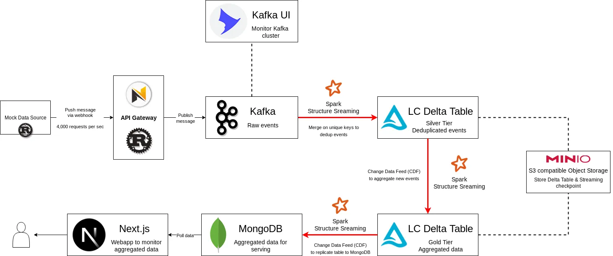

## 🚀 Kafka Real-time Streaming into Liquid Clustering Delta Table

This mini project is for testing the capability of **Liquid Clustering (LC)** and **Change Data Feed (CDF)** features of the **OSS Delta Table** which is open source and *GA* around May 2024 (previously proprietary only in **Databricks Runtime**).

1. **Liquid Clustering:** is a new paradigm with greater performance in optimizing the query/filter big data table stored in **Delta Table** format! Traditionally, one has to do **Hive-style partitioned** and **Z Order** to optimize such tables, which have various limitations (e.g., not suitable for high cardinality columns, requires recreating table on changing partition columns etc.).
2. **Change Data Feed:** is a cool feature for *Delta Table* to allow each operation to be emitted as an event. With this feature, we can use *Delta Table* as streaming source to replicate data to the other sinks!

### TLDR;

> From quick testing, **OSS Liquid Clustering** is super fast! and even faster than traditional *Hive Partitioned* on my use case. Even with a total of 100M events and ongoing 4,000 events per second, the deduplication stream can still keep up without bloating memory usage!

I have compared **Prune IN List** (e.g. `column IN (t1, t2, ...)`) strategy on two table layouts; *Hive Partitioned* and *Liquid Clustering*. It turns out that *Liquid Clustering* can prune files more efficiently leading to faster **MERGE** operation at scale 🔥.

## ⚙️ Quick Setup

1. Install [Just], since this project uses [Just] to store running scripts
2. Run `just run-app` to spin up everything mentioned in [Architecture] section
3. Run `just teardown-app` to destroy all resources of the project in *docker-compose*

## 🏗️ Architecture

The architecture for this project to test the capability of *Delta Table* is as shown below:

### Event Publisher Components

1. **Mock Data Source:** Blazingly fast mock event generator written in Rust, in my testing I set it up at 4,000 RPS, and my Rust app only uses around *150m Core and 20 MiB memory* 🚀.
2. **API Gateway:** Webhook REST API server also written in *Rust* using *Ntex* framework. *Mock Data Source* will publish messages to this *Gateway* rather than publishing messages to *Kafka* directly. This component is also impressive, with only *200m Core and 15 MiB* usage to handle 4,000 RPS!

### Streaming Components

3. **Kafka:** Streaming event platform for ingesting large amounts of events.
4. **Spark Structured Streaming:** Core streaming processor to process streams of events from *Kafka* and *Delta Table* as source.
5. **Liquid Clustering Delta Table:**  
    - *Silver Table:* Deduplicated events in real-time from Kafka using *MERGE* operation. The **Prune In List** strategy is used to efficiently prune unnecessary files for finding duplicate events.
    - *Gold Table:* Aggregated events in real-time using **Change Data Feed (CDF)** from *Silver Table*
6. **MinIO:** AWS S3 compatible storage for storing *Delta Table* at scale.

### Serving Components

7. **MongoDB:** Aggregated data replicated with *CDF* from *Gold Table*.
8. **Next.js:** Webapp to monitor real-time data.

### Monitoring Components

9. **Kafka UI:** UI to monitor Kafka topics and events

[Just]: https://github.com/casey/just?tab=readme-ov-file#installation
[Architecture]: #architecture